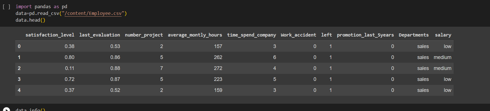
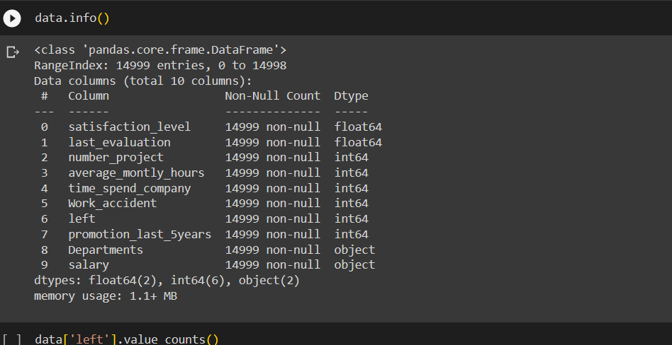
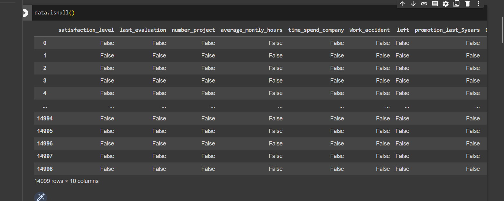
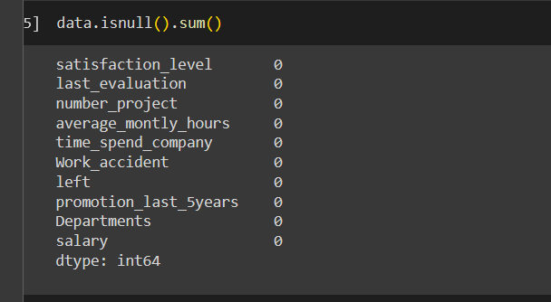
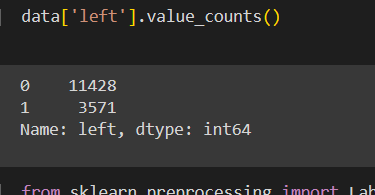
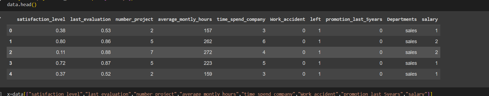
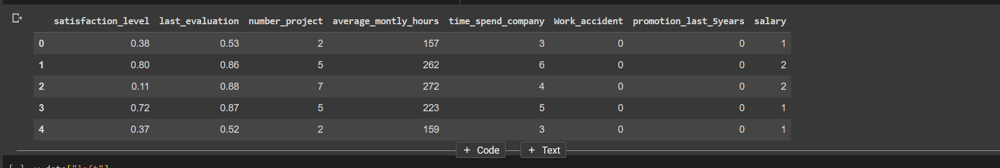
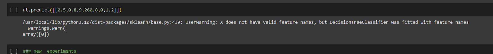

# Implementation-of-Decision-Tree-Classifier-Model-for-Predicting-Employee-Churn

## AIM:
To write a program to implement the Decision Tree Classifier Model for Predicting Employee Churn.

## Equipments Required:
1. Hardware – PCs
2. Anaconda – Python 3.7 Installation / Jupyter notebook

## Algorithm
  1.Prepare your dataClean and format your data Split your data into training and testing sets
  2.Define your model
       Use a sigmoid function to map inputs to outputs Initialize weights and bias terms 
  3.Define your cost function
       Use binary cross-entropy loss function Penalize the model for incorrect predictions 
  4.Define your learning rate
       Determines how quickly weights are updated during gradient descent
  5.Train your model Adjust weights and bias terms using gradient descent Iterate until convergence or for a fixed number of iterations
  6.Evaluate your model Test performance on testing data Use metrics such as accuracy, precision, recall, and F1 score 
  7.Tune hyperparameters Experiment with different learning rates and regularization techniques 
  8.Deploy your model Use trained model to make predictions on new data in a real-world application.

## Program:
```
/*
Program to implement the Decision Tree Classifier Model for Predicting Employee Churn.
Developed by: Praveen s
RegisterNumber:  212222240077
*/
import pandas as pd
data=pd.read_csv("/content/Employee.csv")
data.head()
import pandas as pd
data=pd.read_csv("/content/Employee.csv")
data.head()
data.isnull()
data.isnull().sum()
data['left'].value_counts()
from sklearn.preprocessing import LabelEncoder
le=LabelEncoder()
data['salary']=le.fit_transform(data['salary'])
data.head()
x=data[["satisfaction_level","last_evaluation","number_project","average_montly_hours","time_spend_company","Work_accident","promotion_last_5years","salary"]]
x.head()
y=data["left"]
from sklearn.model_selection import train_test_split
x_train,x_test,y_train,y_test=train_test_split(x,y,test_size=0.2,random_state=100)
from sklearn.tree import DecisionTreeClassifier
dt=DecisionTreeClassifier(criterion="entropy")
dt.fit(x_train,y_train)
y_pred=dt.predict(x_test)
from sklearn import metrics
accuracy =metrics.accuracy_score(y_test,y_pred)
accuracy
dt.predict([[0.5,0.8,9,260,8,0,1,2]])
```

## Output:












## Result:
Thus the program to implement the  Decision Tree Classifier Model for Predicting Employee Churn is written and verified using python programming.
